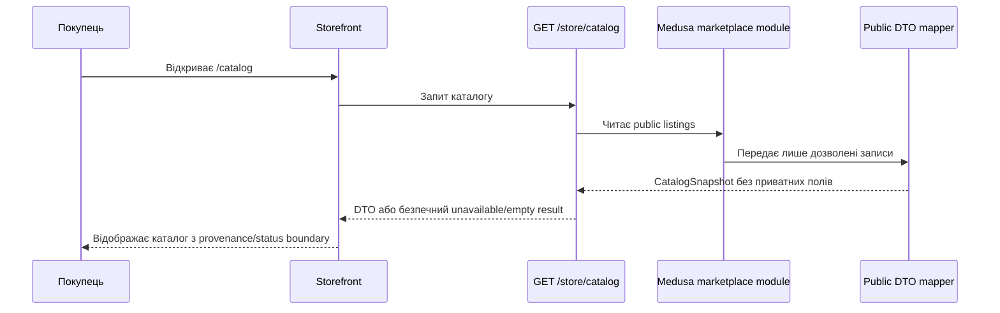
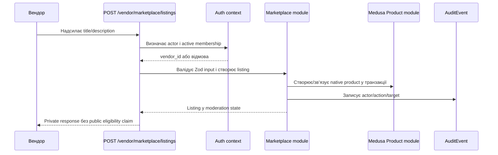
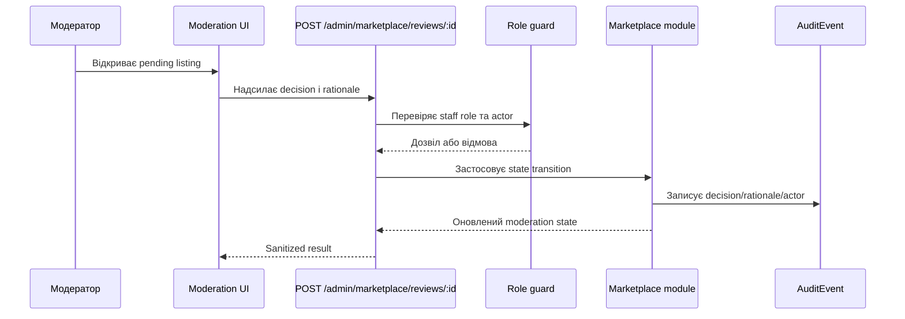
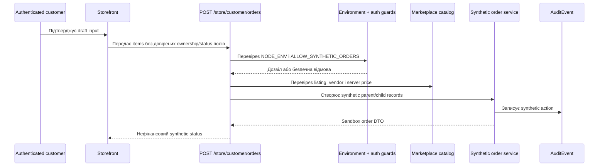
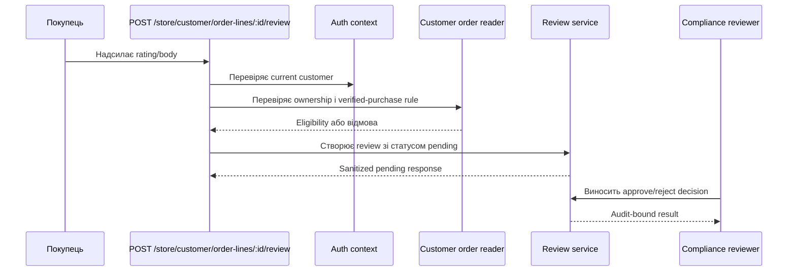

# Діаграми послідовностей «ЛАЙФ»

- **Статус:** концептуальні sandbox/test сценарії
- **Дата огляду:** 2026-08-21
- **Межа:** діаграми пояснюють дозволені server-side контракти; вони не є доказом runtime або production readiness.

## 1. Публічний каталог

Native `/store/products` і mutation/cart endpoints не є публічним authority цього контуру. Відсутність доступного synthetic Medusa режиму не повинна створювати непомітний fixture fallback.

## 2. Створення listing вендором

Tenant id з body не замінює actor-derived context. Помилка транзакції не повинна залишати частково створений public listing.

## 3. Модерація listing

`approved` — технічний workflow state; він не є юридичною сертифікацією vendor, product або claim.

## 4. Synthetic customer order у development/test

Цей flow не викликає payment, fiscal, shipment, carrier, settlement або payout adapter. У production guard synthetic route має бути закритий.

## 5. Review eligibility та moderation

Public mapper показує лише записи з дозволеною provenance і moderation status. Client не може самостійно встановити `verifiedPurchase` або `approved`.

## 6. Заборонені потоки

У поточному scope немає діаграми або runtime flow для:

- live acquiring, escrow, payment webhook чи refund;
- ПРРО/фіскального чека;
- реальної Нової Пошти, ЕН/ТТН або carrier webhook;
- vendor settlement/payout;
- production provisioning/deployment.

Такі потоки потребують окремих прийнятих рішень, контрактів, security review та production gate.
