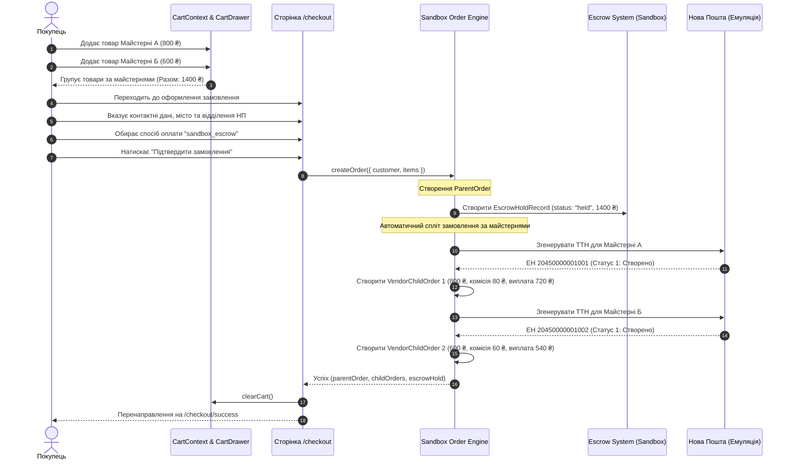
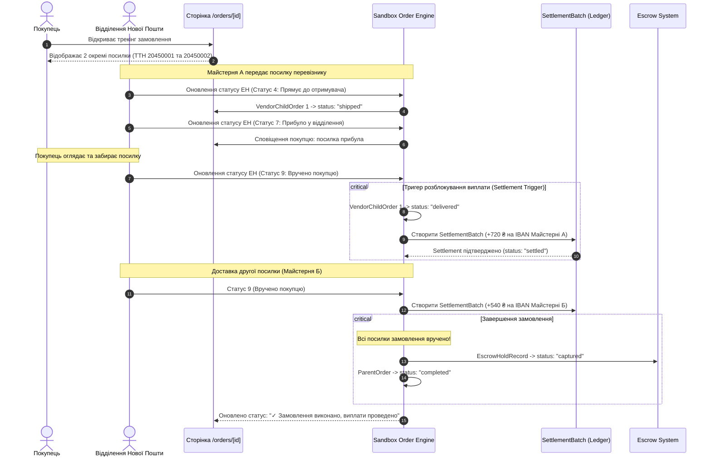
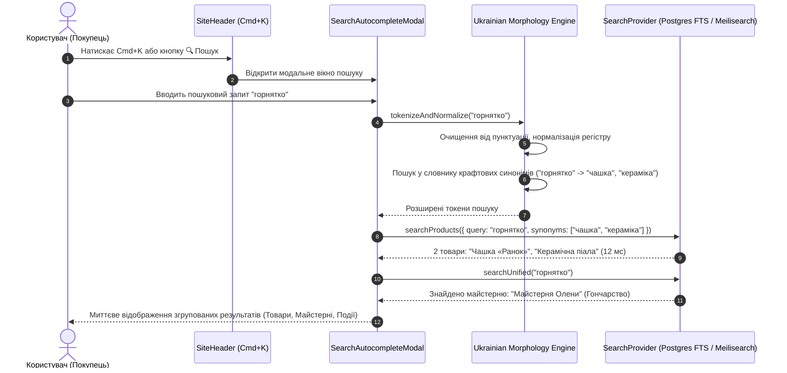
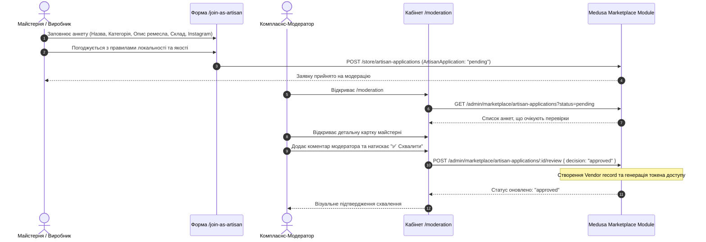

# Діаграми послідовностей маркетплейсу «ЛАЙФ» (Sequence Diagrams)

Цей документ містить детальні діаграми послідовностей (Mermaid Sequence Diagrams) для всіх ключових процесів маркетплейсу.

---

## 1. Мультивендорний кошик, Чекаут та Escrow-холдинг

---

## 2. Відстеження доставки Нової Пошти та автоматична виплата (Settlement)

---

## 3. Пошуковий рушій з автокомплітом та українською морфологією

---

## 4. Онбординг майстерень та дворівнева модерація

